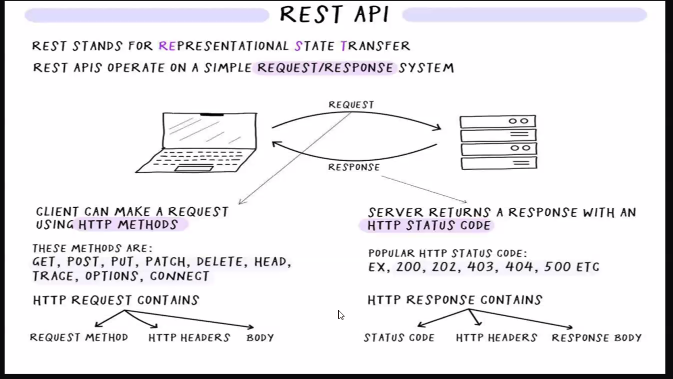

18-09-2026 13:45
Status: _writing_

# API

**API stands for application programming interface**

- application programming interfaces (APIs) are constructs made available in programming languages to allow developers to create complex functionality more easily.
- allows communication between software components.
- it defines rules and protocols for accessing a web-based software application.
- they abstract more complex code away from you, providing some easier syntax to use in its place.

### Categories of API

- open (public)
- partner(restricted)
- internal (private)
- composite

## Rest vs Restful APIs


## REST API



## Synchronous Web Communication

- User must wait while new pages load
- The typical communication patter used in web pages (click,wait,refersh)

## Asynchronous Web Communication

- in Asynchronous javascript , tasks are executed independently of the main program
  flow.
- when an Asynchronous task is encountered, it is initiated and the program continues to execute without waiting for it to complete.

### Callback Functions

- A callback function is a function that is passed as an argument to another function, **called back** at a later time.
- A function that accepts other functions as arguments is called a higher-order function, which contains the logic for when the callback function gets executed.

```js
setTimeout(function () {
  console.log("this function executes after the specified dealy.");
}, 1000);
```

## AJAX

- AJAX is not a programming language.
- AJAX uses a combination of: A browser built-in XMLHttpRequest object (to request data from a web server) Javascript and HTML DOM(to display or use the data).
- Basically what AJAX does is make use of the browser's built-in XMLHttpRequest(XHR) object to send and receive information to and from a web server Asynchronously, in the background, without blocking the page or interfering with the user's experinces.

## Overview of readyState

There are five readyState values

1. 0-UNSENT --> The request has been created but **open() has not been called** yet. No connection to the server exists, no data can be sent or received.
2. 1-OPENED --> The **open() method has been called**, initiallizing the request. At this stage, request headers can be set using `setRequestHeader()`, but the request has not been sent to the sever yet.
3. 2-HEADERS_RECEIVED --> The request has been **sent to the sever**, and the server has responed with HTTP headers. The response body is not yet available, but the status code and headers can be accessed using `status`,`statusText`,`getResponseHeader()`, `getAllResponseHeaders()`
4. 3-LOADING --> Thes response body is **being downloaded**. If the response type is text, the `responsText` property contains partial data as it arrives.
5. 4-DONE --> The operation is **complete**, meaning the entire response has been received.

## Data Structures

### Stack

- js uses the stack data structure to store static or fixed-size data.
- it includes all numbers, strings, booleans, and other primitive data.
- has a fixed size at compile time.
- variables such as objects, arrays, etc are not stored in the stack as their size varies during run time.

> [!Stack Overfolw]
> Stack overflow happens when js keeps calling functions without stopping, eventually filling up the call stack.

> [!Call Stack]
>
> - the call stack is a part of js and it is simply a stack in which you can add an item and the added first is processed last.
> - it follows FILO --> `First In Last Out` principle.
> - it acts as a placeholder or holding area for all the js functions that have been fired for execution.

### Heap

- js uses a heap for storing variables whoes size is unknown at compile time or may vary at run time, such as objects, arrays, functions, etc.
- js engine dynamically allocates memory to the heap. heap sie depends on the available internal memory.

## Event Loop in js

- event loop is a fundamental concept in js for managing asynchronous operations.
- it's a mechanism that allows js to handle tasks such as timers, I/O operations and event handling in a non-blocking manner, ensuring smooth and responsive behaviour in web applications.
- there are three components that constitute Event Loop Architecture.
  1. The call stack
  2. web API
  3. event queue

### Event Queue

- it is a data structure similar to Stack, which holds the data temporarily and the important thing to note is that the **data added first is processed first.** --> it follows **FIFO**--> `First in First out` principle.

## API Fetching

- it is refers to the process of making HTTP request to external web services or APIs to retrieve data or perform specific actions.

- APIs are endpoints provided by web servers that allow you to access and interact with their data and functionality.

- js, both in web browser and on the server-side, is commonly used to fetch data from APIs for various purposes, such as displaying information on a web page, processing data, or integrating with external services.

### HTTP Request

- to fetch data from an API, you need to send an HTTP request to a specific URL

- HTTP methods used for API fetching include

  - GET (for retrieving data)
  - POST (for sending data to the server)
  - PUT (for updating data)
  - DELETE (for deleting data)

> [!NOTE]
> Asynchronous Nature
> Asynchronous operations in js are managed using callbacks, promises, ot the async/await syntax.
> asyn/await : a better and cleaner way of handling the promise is through the asyn/wait keywords. you start by specifying the caller function as async and then use await to handle the promise.

## Error objects

- evalerror:
- internalerror:
- rangeerror:
- referenceerror:
- syntaxerror:
- typeerror:
- urlerroe:

## References
