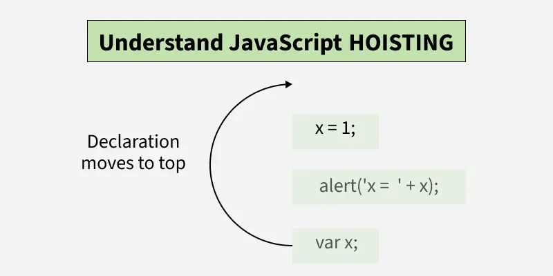
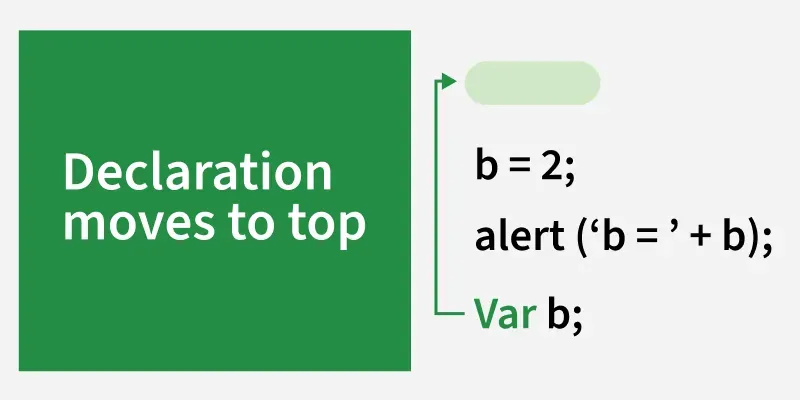

# Hoisting

Hoisting is the behavior in js where js moves the declarations of [[variables]],[[Function]], and [[Classes]] to the top of their [[scope]] during the compilation phase.



## Temporal Dead Zone (TDZ)

It's a period in js between entering a scope and the initialization of variables declared with let or const during which accessing them results in an error.

- variables declared with let and const are hoisted but not initialized.
- accessing these variables before their declaration throws a ReferenceError.
- initialization occurs only when execution reaches the declaration line.
- TDZ exist only within the scope where the variable is declared.
- it applies only to let and const, not to var (which is initialized as undefined).

## Types of Hoisting

- variable Hoisting with var
  When var key word is used the declaration is hoisted to the top, but its value is not assigned until the code reaches the variable's initialization. this results in variable being assigned undefined during the hoisting phase. in simple words variable will remain undefined before the initialization of the variable,

> [!NOTE]
> var hoisting lifts declaration not initializations
> 

```js
// this prints the variable due to var hoisting
b = 2;
console.log(b);
var b;

// this will not work due to var hoisting
console.log(a); // undefined
var a = 5;
```

- variable hoisting with let and const
  Unlike [[var]], [[let]] and [[const]] are also hoisted, but they remain in a TDZ from the start of the block until their declaration is encountered.

```js
// Both of these will show error that cannot be accessed before initialization.
console.log(b);
let b = 10;

console.log(pi);
const pi = 3.14;

// Both these will not work unlike var variable key word
c = 3;
console.log(c);
let c;

d = 0;
console.log(d);
const d;
```

> [!NOTE]
> the variable is hoisted, but it's in the temporal dead zone until the declaration line is executed.

## References

[hoisting](https://www.geeksforgeeks.org/javascript/javascript-hoisting/)
