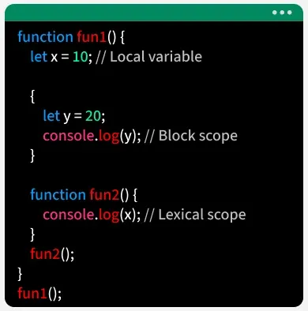

# Scope

Scope in js defines where a variable can be accessed or used within a program. It controls the visibility and lifetime of a variable across different parts of the code.

- determines the accessibility of [[variables]] in different parts of the program.
- restricting variable usage to specific areas.
- improves code readability.
- defines the lifetime of variables during program execution.

## types of scope

1. global scope
2. local(function) scope
3. block scope

### global scope

A global variable is a variable that is declared outside any function or block, so it can be accessed anywhere in the program both inside functions and in the main code .

```js
let x = 10;
function hello() {
  let y = 20;

  console.log(y);
  console.log(x);
}
console.log(x); // prints the variable since it is global scope, it can be accessed in both inside and outside the function.
console.log(y); // shows error the variable value since it is local/function scoped.
```

### local scope

A local scoped variable is a variable declared within a function, making it accessible only inside that function. it cannot be used outside the function. variables declared inside a block using `let` or `const` are block-scoped.

```js
function anything() {
  let b = "hello";
  console.log(b); // prints the value since the variable is called within the function block
}
console.log(b); // shows error
```

### block scope

Block scope in js means variables declared with let or const inside a block are accessible only within that block, and accessing them before declaration (TDZ) causes a ReferenceError.

```js
function fun1() {
  let x = 10;
  {
    let y = 20;
    console.log(y); // block-scoped variable this variable is only visible or accessible inside this block only
  }
  console.log(y); // shows error since the variable is block-scoped
  console.log(x); // prints the variable vlaue since it is function-scope and i am calling it within the function
}
console.log(x); // shows error since the variable is function scoped not global scoped
```



> [!NOTE]
> Variables declared with var do not have block scope. If declared inside a function, they are accessible throughout that function regardless of blocks such as if statements or loops. In classic scripts, a var declared outside any function becomes globally scoped. In ES modules, top-level var is module-scoped.

## References
