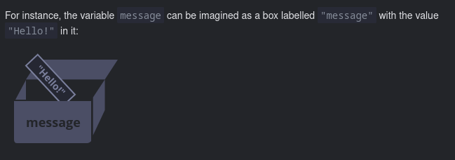
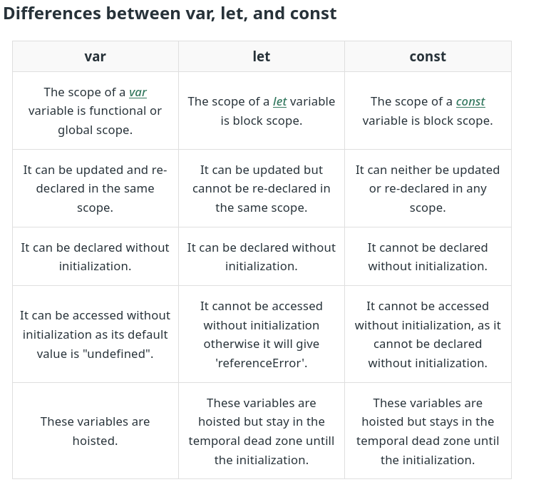

# variables

A **variable** is a `named storage` for data. Imagine variable a named box which is used to store data, we can store all store of data's in a variable.



```js
let message;
message = "Hello!";
console.log(message); // print Hello!
message = "world!"; // value changed
console.log(message); // print world
```

## variable declaration

A variable in js can be declared in mainly three types that are listed below

1. [[let]] - is a modern variable declaration.
2. [[const]] - is used to declare those values which remains constant.
3. [[var]] - it is an old method to declare variable , now is less common now-days.

## Comparison



## variable naming

There certain rules in naming variables in js.

1. the name must contain only letters,digits,or the symbols `$` and `_`.
2. the first character must not be a digit.

```js
let userName;
let test123;
let $ = 1;
let _ = 2;
let myFirstNote = "hello"; // example for camelCase
```

> [!NOTE]
> there is a list of reserved words which cannot be used as variable names because they are used by the language itself. they include words like let, class, return, function etc. also note that when a variable must contain more than one word the we normally uses camelCase.

```js
let let =6;
let return=5; // these are not allowed
```

## References

[Variables](https://javascript.info/variables)
